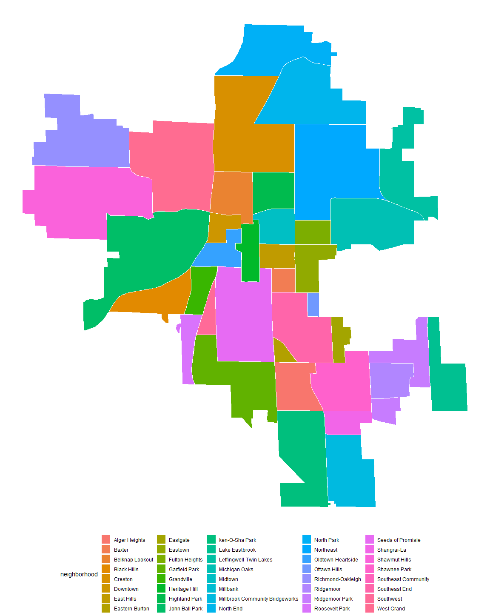

Untitled
================

This is a ggplot friendly version of the map of Grand Rapids
Neighborhoods found
[here](https://hub.arcgis.com/datasets/a59c2c3795c442b3af86071c5ee2d74a_0?geometry=-86.182%2C42.868%2C-85.139%2C43.044).
See below for example.

``` r
grand_rapids %>% 
ggplot()+
  geom_polygon(aes(x = long, y = lat, group = id, fill = neighborhood), color = "white")+
  theme_void()+
  theme(legend.position = "bottom")
```

<!-- -->
